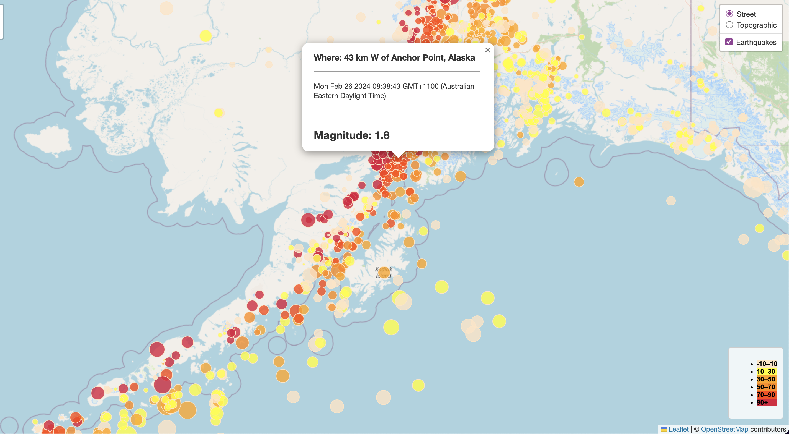

# Leaflet-Challenge

*In this assignment, I will leverage my skills in Leaflet, JavaScript, and interactive visualization to access and extract data from a provided URL link. I will then visualize earthquakes and their properties from the past month worldwide..*

# Background

The United States Geological Survey, or USGS for short, is responsible for providing scientific data about natural hazards, the health of our ecosystems and environment, and the impacts of climate and land-use change. Their scientists develop new methods and tools to supply timely, relevant, and useful information about the Earth and its processes.

The USGS is interested in building a new set of tools that will allow them to visualise their earthquake data. They collect a massive amount of data from all over the world each day, but they lack a meaningful way of displaying it. In this challenge, you have been tasked with developing a way to visualise USGS data that will allow them to better educate the public and other government organisations (and hopefully secure more funding) on issues facing our planet.

# Step by step
# Creating the Earthquake Visualisation

* I collected the dataset from `USGS GeoJSON Feed`. I choose to work with that from the past month.
* Copied the URL to set it as my query for the project for data importation.
* Using Leaflet I created a map that plots all the earthquakes by their coordinates.
* I set the marker to reflect the magnitute of the earthquake by its size and hold the color of the marker depending on the depth of the earthquake.
* Included popup with aidditional information about the earthquake when the marker is clicked.

* Then, I created a legend and edited its styling for aesthetics.

#### Technologies used
* Visual Studio Code 
* **JavaScript**
* **Leaflet**

* *GitHub - deployment* 

#### File list
* logic.jc
* css directory with styling
* index.html
* Various Screen Shots in directory "ss"

Cover Photo Source: https://www.google.com/url?sa=i&url=https%3A%2F%2Fnewsolutions.org%2Fprograms%2Fesp-program-usgs%2F&psig=AOvVaw00HgbQSN6raEp5IqHw4JZG&ust=1711505113405000&source=images&cd=vfe&opi=89978449&ved=0CBIQjRxqFwoTCOjIqMPrkIUDFQAAAAAdAAAAABAE